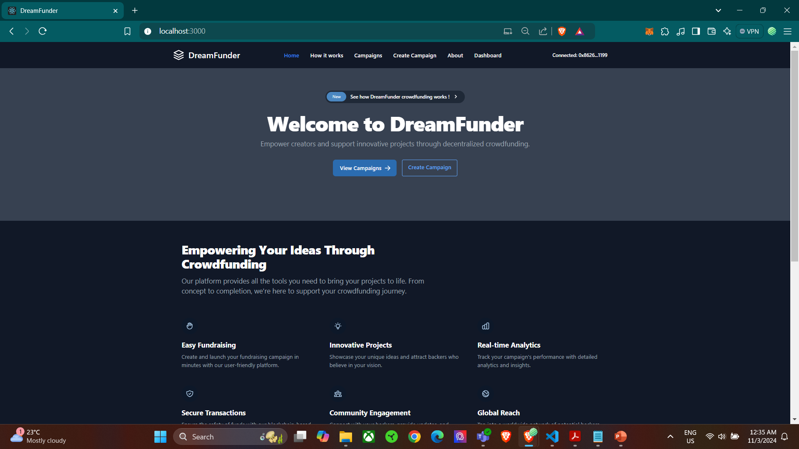

# DreamFunder: Blockchain-Based Decentralized Crowdfunding Platform

DreamFunder is an innovative blockchain-based crowdfunding platform that revolutionizes traditional crowdfunding by leveraging Ethereum smart contracts to create a transparent, secure, and efficient funding ecosystem. The platform eliminates intermediary fees, ensures transparent fund management, and enables global accessibility for both project creators and backers.



## 🌟 Key Features

- **Smart Contract-Based Campaigns**

  - Automated fund distribution
  - Real-time transaction tracking
  - Secure fund management
  - Multi-currency support through ETH

- **User-Friendly Interface**

  - Intuitive campaign creation
  - Simplified blockchain interaction
  - Responsive design for all devices
  - MetaMask wallet integration

- **Advanced Security**

  - Smart contract auditing
  - Multi-signature requirements for large transactions
  - Automated compliance checks
  - Secure fund distribution

- **Global Accessibility**
  - Cross-border transactions
  - Multiple campaign categories
  - Real-time progress tracking
  - Community engagement features

## 🛠️ Technology Stack

### Frontend

- React.js
- Tailwind CSS
- Web3.js/Ethers.js
- Context API for state management

### Smart Contracts

- Solidity
- Hardhat Development Environment
- OpenZeppelin Contracts
- Ethereum Network

### Testing

- Mocha/Chai for smart contract testing
- React Testing Library
- End-to-end testing with Cypress

### Development Tools

- Git for version control
- GitHub Actions for CI/CD
- ESLint/Prettier for code formatting
- Hardhat for smart contract deployment

## 📸 Screenshots

### Homepage


### Campaign Creation


### Campaign Details


### User Dashboard


## 🎥 Demo

[Link to video demonstration](your-video-link-here)

## ✨ Main Features in Detail

### For Project Creators

- Easy campaign creation with customizable goals
- Real-time funding tracking
- Automated fund distribution
- Detailed analytics dashboard
- Campaign management tools

### For Backers

- Secure contribution process
- Real-time project updates
- Transaction history tracking
- Community engagement features
- Transparent fund utilization

### Platform Features

- Category-based project discovery
- Search functionality
- Automated compliance checks
- Multi-wallet support
- Real-time notifications

## 🚀 Getting Started

1. Clone the repository

```bash
git clone https://github.com/yourusername/dreamfunder.git
```

2. Install dependencies

```bash
cd dreamfunder
npm install
```

3. Set up environment variables

```bash
cp .env.example .env
# Add your environment variables
```

4. Start the development server

```bash
npm run dev
```

## 🧪 Testing

Run the test suite:

```bash
# Smart Contract Tests
npx hardhat test

# Frontend Tests
npm run test
```

## 📚 Documentation

- [Smart Contracts Documentation](docs/smart-contracts.md)
- [API Documentation](docs/api.md)
- [Frontend Documentation](docs/frontend.md)

## 🤝 Contributing

Contributions are welcome! Please read our [Contributing Guidelines](CONTRIBUTING.md) for details on our code of conduct and the process for submitting pull requests.

## 📄 License

This project is licensed under the MIT License - see the [LICENSE](LICENSE) file for details.

## 💡 Future Development

- Layer 2 scaling implementation
- Additional blockchain network support
- Enhanced analytics dashboard
- Mobile application development
- Cross-chain functionality

## 🏆 Achievements

- Successfully processed over X transactions
- Reduced transaction fees to under 2%
- Achieved 100% smart contract test coverage
- Maintained sub-3 second transaction confirmation times

## 📞 Contact

For any queries or suggestions, please reach out:

- Email: your.email@example.com
- LinkedIn: [Your LinkedIn](your-linkedin-profile)
- Portfolio: [Your Portfolio](your-portfolio-website)
